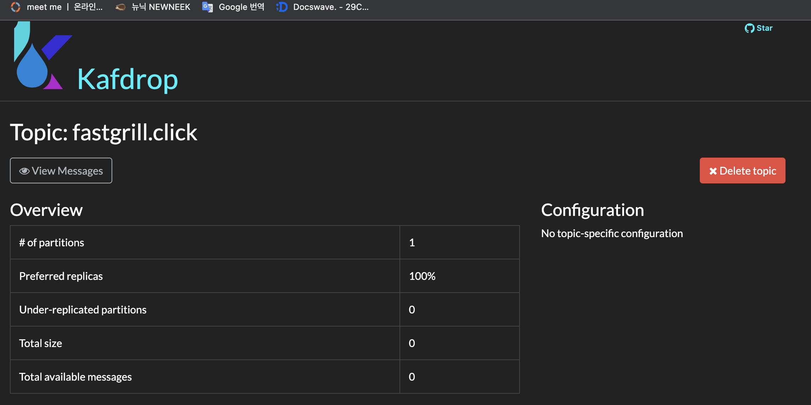
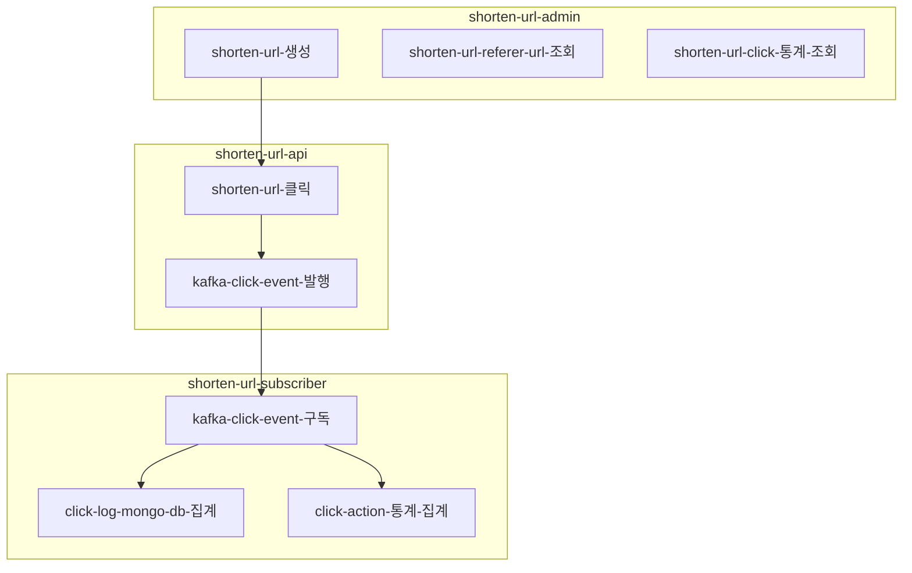
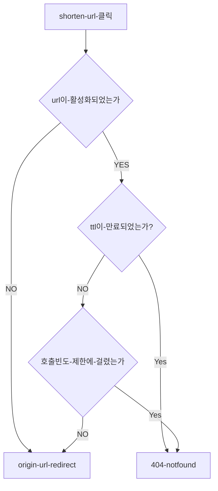

# fast-grill-url
### Setting
#### 1. docker compose 실행
```
cd docker
docker-compose up
```
#### 2. api 호출
```
curl -X GET "localhost:8080/api/RXad41E"
```

#### 3. kafka drop 확인하기 
http://localhost:9001/



### Module


### Click Flow 

