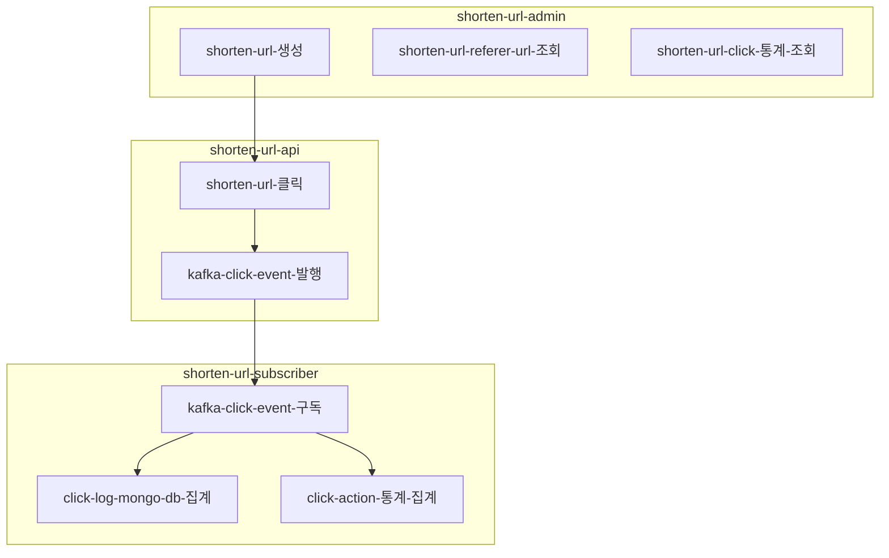
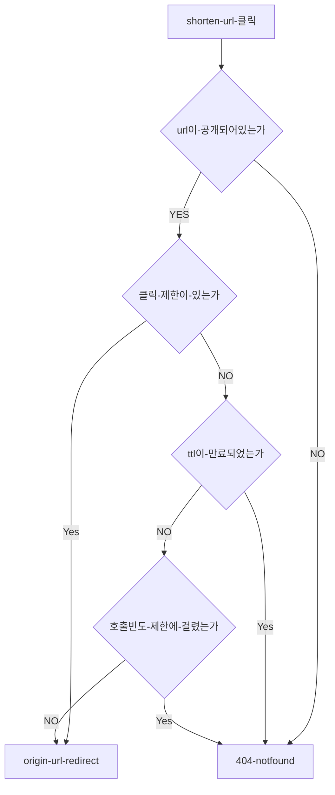

# url-shortener
### Module

```mermaid
flowchart TB
    subgraph shorten-url-admin
    shorten-url-생성
    shorten-url-referer-url-조회
    shorten-url-click-통계-조회
    end
   subgraph shorten-url-api
    shorten-url-생성-->shorten-url-클릭
    shorten-url-클릭-->kafka-click-event-발행
    end
    subgraph shorten-url-subscriber
    kafka-click-event-발행-->kafka-click-event-구독
    kafka-click-event-구독-->click-log-mongo-db-집계
    kafka-click-event-구독-->click-action-통계-집계
    end
```

### Click Flow 

```mermaid
flowchart TD
    A[shorten-url-클릭] --> H{shorten-url이-공개되어있는가}
    G -->|Yes| E[origin-url-redirect]
    H{url이-공개되어있는가} --> |YES| G{클릭제한이-있는가}
    H --> |NO| D[404-notfound]
    G{클릭-제한이-있는가} --> |NO| B{ttl이-만료되었는가}
    B -->|Yes| D[404-notfound]
    B{ttl이-만료되었는가} --> |NO| C{호출빈도-제한에-걸렸는가}
    C -->|Yes| D[404-notfound]
    C -->|NO| E[origin-url-redirect]
```
